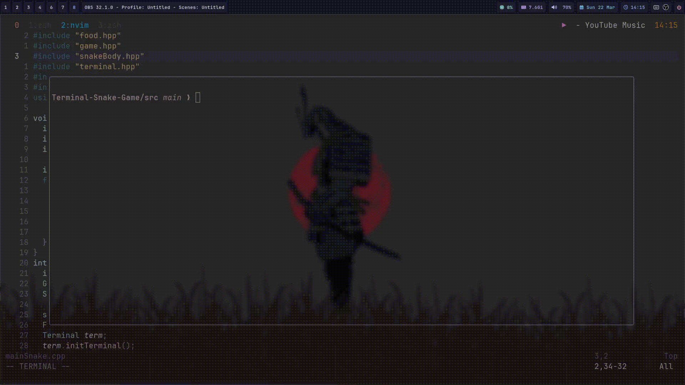

# Terminal Snake

A snake game built entirely in C++ for the terminal — no external libraries, no ncurses, no shortcuts.  
All rendering and input handling done manually with **termios** and **ANSI escape codes**.



---

## why this exists

Most terminal games lean on ncurses to handle the hard parts. This one doesn't.  
Raw mode input, manual screen redraws, and direct cursor control — built to understand what's actually happening at the terminal level.

---

## features

- Raw terminal mode via `termios` — non-blocking keypress detection without Enter
- Full screen redraws using ANSI escape codes (`\033[2J\033[H`)
- Random food spawning with `<random>`
- Collision detection — walls and self
- Score tracking
- Restart without re-launching

---

## controls

| Key | Action |
|-----|--------|
| `W` / `↑` | Move Up |
| `A` / `←` | Move Left |
| `S` / `↓` | Move Down |
| `D` / `→` | Move Right |
| `R` | Restart |
| `Q` | Quit |

---

## build & run

Requires a C++17 compiler and a POSIX-compatible terminal (Linux / macOS).

```bash
git clone https://github.com/KagE-Akumaa/Terminal-Snake-Game.git
cd Terminal-Snake-Game
g++ src/*.cpp -o snake -std=c++17
./snake
```

---

## tech

- **Language:** C++17
- **Input:** `termios.h` — raw mode, non-blocking reads via `fcntl`
- **Rendering:** ANSI escape codes — no external rendering library
- **Environment:** Linux terminal
